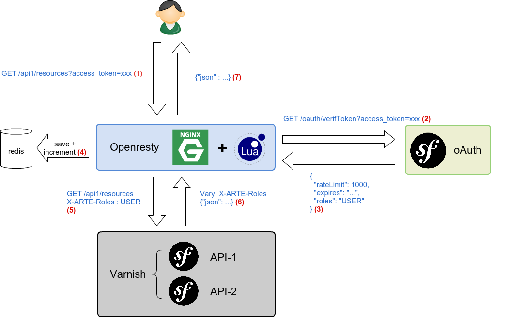

name: inverse
layout: true
class: center, middle, inverse
---
#Retour d'expérience ARTE GEIE :
### Développement API

???
Raccourci clavier : P -> permet d'afficher le plan
Raccourci clavier : C -> permet d'ouvrir une autre fenêtre avec les slides

Bonjour à tous.
Merci d'être venu si nombreux.

---
# Ich heiße François Dume
.twitter[[@`\_franek\_`](https://twitter.com/_franek_)]

???
Je m'appelle François Dume.

---
layout: false
class: layout-arte

.center[]
.pull-left[.center[]]
.pull-right[.center[]]

???
Je travaille chez ARTE à Strasbourg.
ARTE est une chaine franco-allemande, disponible sur le canal 7 de votre téléviseur.

<!--
-
class: layout-arte,center,middle
#.line-through[Dominique Chapatte]

???
* Dominique Chapatte ne travaille pas chez Arte. Vous pouvez le retrouver sur M6.

-->

---
class: layout-arte
background-image: url(./images/capture-artetv.png)

???
Au niveau numérique, ARTE édite un certain nombre de sites internet : arte.tv

---
class: layout-arte
background-image: url(./images/capture-future.png)

???
Future, plateforme dédiée à la science

---
class: layout-arte
background-image: url(./images/capture-creative.png)

???
Creative, plateforme dédiée aux arts visuels et numériques

---
class: layout-arte
background-image: url(./images/capture-concert.png)

???
Concert, anciennement Arte Live Web

---
class: layout-arte
background-image: url(./images/capture-cinema.png)

???
Cinéma, qui permet de retrouver les films diffusés à l'antenne

---
class: layout-arte
background-image: url(./images/capture-tracks.png)

???
Tracks, exemple de site d'une émission

---
.center[]
<br />


.center[...]
.center[]

???
On développe une solution de CatchUP (ARTE+7). Cette solution est packagée dans la plupart des box des opérateurs.
On développe également des applications pour les TV connectées (hbbtv).

---
class: layout-arte, middle

.pull-left[.center[<a href="https://itunes.apple.com/fr/app/arte/id405028510?mt=8"></a>]]
.pull-right[.center[<a href="https://play.google.com/store/apps/details?id=tv.arte.plus7&hl=fr_FR"></a>]]

???
On édite également des applications mobiles, notamment pour android et Apple.

---
class: center, middle, inverse

# We need .small[_(to be)_] API !

???
Pour pouvoir développer ces magnifiques applications, nous avons besoin d'API.
---

# Mise à disposition :

* Des **métadonnées des programmes** diffusés à l'antenne (titre, description, photo, producteur, casting, horaires de diffusion)
* Des **URLs des streams** (mp4, hls)
<!--* De flux optimisés pour une plate-forme dédiée (applications mobiles, TV connectées, ...)-->
* Des **statistiques de consultation** de nos contenus

???
plage de droits, heures de diffusion

---
#Exemple :
```json
  {
    "videos": [
        {
            "id": "055075-000-A_SHOW_ALW_FR_fr",
            "programId": "055075-000-A",
            "channel": "FR",
            "language": "fr",
            "kind": "SHOW",
            "platform": "ALW",
            "title": "Angus & Julia Stone \u00e0 la Maroquinerie",
            "originalTitle": "Angus & Julia Stone \u00e0 la Maroquinerie",
            "durationSeconds": 3101,
            "shortDescription": "Depuis Down The Way en 2010, Angus et Julia s'\u00e9taient \u00e9chapp\u00e9s chacun de leur c\u00f4t\u00e9 chantant l'un sans l'autre pendant un temps. La s\u00e9paration ne f\u00fbt heureusement pas d\u00e9finitive puisque les fr\u00e8res et soeurs retrouvent aujourd'hui le chemin vers de nouvelles sc\u00e8nes. Les retrouvailles se scellent \u00e9galement dans un troisi\u00e8me album o\u00f9 les puret\u00e9s folk et les m\u00e9lodies fredonn\u00e9es c\u00f4toient les ballades cotonneuses et les mots doux. ",
            "producer": "ARTE FRANCE",
            "videoRightsBegin": "2014-08-25T17:00:00Z",
            "videoRightsEnd": "2015-02-25T22:59:00Z",
            "mainImage": {
                "name": "055075-000_1392179_32_202.jpg",
                "extension": "jpg",
                "caption": "Angus & Julia Stone",
                "url": "http:\/\/www.arte.tv\/prog_img\/IMG_APIOS\/055000\/055000\/055075-000_1392179_32_202.jpg"
            },
            "programmingId": 1781191,
            "mainReassembly": true,
            "reassembly": "A",
            "reassemblyRef": "A",

```

---
class: center, middle, inverse

# Développement d'une nouvelle API

???
Nous disposons déjà d'une API qui permet de mettre à disposition le contenu antenne.

---
# Objectifs

* volonté de mettre à disposition tout le contenu ARTE
* adresser de manière unifiée tous les workflows
  * broadcast (ARTE+7)
  * web (Concert, Future, Creative, ...)
* ouverture (Open Data ?)
* authentification oAuth
* suivi de l'usage (throttling)

???
Pas seulement le contenu broadcast mais également les contenus développés pour le web. On a de plus en plus de contenu créé uniquement pour le web qui dispose d'un workflow différent de publication.

---
# Architecture technique

* socle Symfony2/MongoDB
* synchronisation des données via messages asynchrones (RabbitMQ)
* utilisation du standard [{json:api}](http://www.jsonapi.org)
* découplage en composants autonomes (microservices ?) :
  * authentification
  * Open Program API (OPA)
  * générateur de player ARTE (iframe/oEmbed)
  * statistiques
---
class: center, middle, inverse


???

Mis en production pour 24h Jerusalem en avril 2014.
Début du développement décembre. Utilisé par Tracks.


---
class: center, middle, inverse
# Sécurisation des API et throttling
---

class: middle

* API sécurisée par authentification **oAuth 2.0**
* Mise en place d'un **reverse proxy authentifiant** ([Openresty](http://openresty.org), distribution nginx avec support de Lua)
* Développement de scripts [Lua](http://fr.wikipedia.org/wiki/Lua) chargés dans la configuration nginx permettant de valider le token oAuth
* Toutes les API "sécurisées" sont protégées par ce reverse proxy
* Le reverse proxy authentifiant est également en charge du **throttling** (exemple : 1000 requêtes/heure)

???
* Ce reverse proxy est utilisable avec tout type de serveur applicatif (Symfony2, Ruby, Java).
* Le serveur applicatif n'a pas connaissance des utilisateurs. Il ne possède que la notion de rôles.

---
class: center, middle, inverse
# Exemple d'un process de requête à nos API

---

# 1. Interrogation du serveur oAuth pour récupérer un token oAuth

```bash
curl https://.../oauth/token?client_id=...
&client_secret=...&grant_type=credentials
```

Réponse :
```json
{
"access_token":"MDBjYzMzNTRjNTQxM...",
"expires_in":3600,
"token_type":"bearer",
"scope":"user",
"refresh_token":"ZTJjZTEyOWFiNjQ1YTkw...",
"roles":["USER"],
"rate_limit":1000
}

```

---

# 2. Utilisation du token

```bash
curl -I https://.../api1/resource?access_token=MDBjY...
```

```data
HTTP/1.1 200 OK
Server: openresty
Date: Thu, 23 Oct 2014 19:51:39 GMT
Content-Type: application/vnd.api+json
Vary: X-ARTE-Roles
X-Rate-Limit-Limit: 1000
X-Rate-Limit-Remaining: 999
X-Rate-Limit-Reset: 1412887899
...
```

---

# 3. Après 1000 requêtes...

```bash
curl -I https://.../api1/resource?access_token=MDBjY...
```

```data
HTTP/1.1 429 Too Many Requests
Server: openresty
```

---
class: center

# Schéma d'architecture globale

.center[]

???
Un Reverse Proxy qui protège toutes nos applications.
Une application oauth : Symfony2, FOSOauthServerBundle, fournisseur d'identités
Plusieurs API (api1, api2).
Une base de données clé-valeurs associée au serveur nginx. Cette base de donnée sert de cache et de stockage du suivi de l'usage (Redis, mémoire partagée, memcache).

---
(1) L'utilisateur fait une requête à une de nos API avec un token

```bash
curl -I https://.../api1/resource?access_token=MDBjY...
```

???
Il passe en paramètre le access_token oAuth.

---
(2) nginx va essayer de valider le token oAuth en effectuant une sous-requête au fournisseur d'identité (oAuth 2.0) :

```lua
local token = ngx.var.arg_access_token
local subrequest = ngx.location.capture(
	'/oauth/verifToken?access_token=' .. token
)
if subrequest.status == ngx.HTTP_OK then
  local content = subrequest.body
  ...
end
```

???
Cette sous-requête ne sera exécutée que lorsque nginx ne connait pas le token.

---
(3) Si le token est valide, le serveur oAuth va retourner au serveur nginx des informations liées au token :

```data
HTTP/1.1 200 OK
Server: openresty
...
{
"client": "Tracks",
"rateLimit": 1000,
"expires": 3600,
"roles" : "USER"
...
}
```
---
(4) Ces informations seront stockées par nginx dans une base de données clé-valeur, l'attribut "remaining" est décrémenté.


```lua
local succ, err, forcible = cache:set(
  key, content, contentLife
)
...
cache:incr('throttle_' .. key, 1)
```

.small[N.B : À la requête suivante, le Reverse Proxy n'interrogera plus le serveur oAuth, il lira son cache et décrémentera "remaining".]

---

(5) Si le token est valide, le Reverse Proxy accepte de rediriger la requête au backend et ajoute des entêtes à la requête (rôles) :
```data
GET http://api1.local/api1/resource
X-ARTE-Roles: USER
```

La réponse du backend contient bien un entête pour faire varier le cache :
```data
Vary: X-ARTE-Roles
```

---

(6) Le backend traite la réponse. En renvoyant la réponse, le Reverse Proxy ajoute les entêtes de suivi d'usage :

```lua
ngx.header["X-Rate-Limit-Limit"] = userRateLimit
ngx.header["X-Rate-Limit-Remaining"] = remaining
ngx.header["X-Rate-Limit-Reset"] = expiresAt
```

---
(7) \o/ L'utilisateur reçoit la réponse

```data
HTTP/1.1 200 OK
Server: openresty
Content-Type: application/vnd.api+json
Cache-Control: max-age=60, public, s-maxage=60
Vary: X-ARTE-Roles
X-Rate-Limit-Limit: 5000
X-Rate-Limit-Remaining: 4997
X-Rate-Limit-Reset: 1413659922

{
	"content" : ...
}
```

---
# Configuration nginx

```.nginxconf
location /api1 {
    # lua_code_cache off; # Dev : disable cache
    set $roles ''; # This variable is set by lua script
    access_by_lua_file /dir/oauth-throttle.lua;
    header_filter_by_lua_file /dir/header-filter.lua;
    proxy_pass http://api1.local;
    proxy_set_header X-Roles $roles;
}

# api2 n'est pas protégé par oAuth
location /api2 {
    proxy_pass http://api2.local;
}
```
Pour aller plus loin, [documentation du module Lua pour nginx](http://wiki.nginx.org/HttpLuaModule)

???
Description des directives
  * init_by_lua : script lua exécuté au démarrage du processus nginx principal (inclusion de librairie)
  * init_worker_by_lua : script lua exécuté au démarrage d'un worker nginx
  * content_by_lua : script de génération de contenu (~= php)
  * log_by_lua : est appelé à chaque écriture de log
  * rewrite_by_lua : script exécuté après un traitement de réécriture d'URL
  * access_by_lua : script intervenant lors de l'accès à une ressource (permet de protéger une URL, par exemple)
  * header_filter_by_lua : permet d'ajouter des headers dans la réponse

---
# ça marche !!

* 1500 requêtes/minute
* temps de réponse : en moyenne <50ms
* 2 VM load balancés

Prévision :
 * 10x cette charge

---
# Limites de la solution

* la première requête est plus lente (sous-requête vers le serveur oAuth)
  * on pourrait modifier le script lua pour lire la BDD du serveur oAuth
* tests de la solution
  * pas de framework de tests unitaires
  * mise en place de tests fonctionnels (casper-js, [frisby.js](http://frisbyjs.com/))
* peu de documentation (bientôt un article sur le blog d'Arte et/ou sur le blog de Jolicode - ping .twitter[[@ThibZ](https://twitter.com/ThibZ)])

---
# Solutions alternatives (throttling)

* Implémentation au niveau du backend : il y a un bundle Symfony2 pour ça (.small[est-ce que vous voulez vraiment recevoir une requête sur votre applicatif pour gérer le throttling ?]) :
  * [noxlogic/ratelimit-bundle](https://github.com/jaytaph/RateLimitBundle) ([details](https://www.adayinthelifeof.nl/2014/05/28/throttle-your-api-calls-ratelimitbundle/))
* Implémentation Varnish
  * [libvmod-throttle](https://github.com/nand2/libvmod-throttle)
* Autres solutions ? (Vos retours m'intéressent !)

???
Configuration mutualisée sur toute la plate-forme, difficilement modifiable

---
class: center, middle, inverse
# Standard [{json:api}](http://www.jsonapi.org)

???
S'appuyer sur un standard pour construire toutes nos API.
Il n'a rien de très révolutionnaire. Ce standard décrit certains mécanismes qui sont des standards de facto.
Il détaille à la fois le format de la réponse JSON mais également la manière de requêter l'API.

---
class: center, middle
# **[{json:api}](http://www.jsonapi.org)**  est un standard pour construire une API

???
L'objectif de JSON API est conçu pour limiter le nombre de requêtes et la taille des requêtes à réaliser entre le client et le serveur.

> A JSON object MUST be at the root of every JSON API document. This object defines a document's "top level".
>
> A document's top level SHOULD contain a representation of the resource or collection of resources primarily targeted by a request (i.e. the "primary resource(s)").
>
> The primary resource(s) SHOULD be keyed either by their resource type or the generic key "data".
>
> A document's top level MAY also have the following members:
>
>  * "meta": meta-information about a resource, such as pagination.
>  * "links": URL templates to be used for expanding resources' relationships URLs.
>  * "linked": a collection of resource objects, grouped by type, that are linked to the primary resource(s) and/or each other (i.e. "linked resource(s)").
>
> No other members should be present at the top level of a document.

---
# Exemple de réponse

```bash
GET /posts?limit=1
```

```json
{
  "links": {
    "posts.author": {
      "href": "http://example.com/people/{posts.author}",
      "type": "people"
    },
    "posts.comments": {
      "href": "http://example.com/comments/{posts.comments}",
      "type": "comments"
    }
  },
  "posts": [{
    "id": "1",
    "href" : "http://example.com/posts/1"
    "title": "Rails is Omakase",
    "links": {
      "author": "9",
      "comments": [ "5", "12", "17", "20" ]
    }
  }]
}
```

---
**[{json:api}](http://www.jsonapi.org)** décrit la manière d'inclure des sous-documents (réduction du nombre de requêtes)

```bash
GET /users?limit=1&include=groups
```

```json
{
...
  "users": [
      {
          "id": "gaston",
          "username": "Gaston",
          "href": "https://server/users/gaston",
          "links": {
              "groups": {"href": "https://server/groups?user=gaston"}
          }
      }
    }
  ],
  "linked" : {
    "groups": [
      {
        "id": "group1",
        "name" : "group1",
        "href": "https://server/groups/group-1",
      },
      {
        "id": "group-2",
        "name" : "group2",
        "href": "https://server/groups/group-2",
      },
    ]
  }
}
```

---
**[{json:api}](http://www.jsonapi.org)** décrit comment limiter les attributs retournés :
```bash
GET /users?limit=1&fields=id
```

```json
{
"users": [
      {
          "id": "gaston",
          "href": "https://server/users/gaston",
          "links": {
              "groups": {"href": "https://server/groups?user=gaston"}
          }
      }
    }
  ]
}
```

```bash
GET /users?limit=1&fields=id,name
```


```json
{
"users": [
      {
          "id": "gaston",
          "name": "Gaston",
          "href": "https://server/users/gaston",
          "links": {
              "groups": {"href": "https://server/groups?user=gaston"}
          }
      }
    }
  ]
}
```

<!--

-
**[{json:api}](http://www.jsonapi.org)** propose une syntaxe évoluée pour les filtres :

```bash
GET /users?id=gaston,fantasio
```

```json
{
"users": [
      {
          "id": "gaston",
          "href": "https://server/users/gaston",
          "links": {
              "groups": {"href": "https://server/groups?user=gaston"}
          }
      },
      {
          "id": "fantasio",
          "href": "https://server/users/fantasio",
          "links": {
              "groups": {"href": "https://server/groups?user=fantasio"}
          }
      }
    }
  ]
}
```

-->

---
# Création de requête complexe avec **[{json:api}](http://www.jsonapi.org)**

```bash
GET /users?enable=true&tags=marsupilami,spirou&fields=name
&include=groups&sort=-id
```

Retourne la liste des utilisateurs actifs triés par **id** possédant les **tags** *marsupilami* et *spirou* en incluant les groupes associés à ces utilisateurs. On ne retourne que le champ **name**.

---
class: center, middle, inverse
# Solutions mises en oeuvre
# pour l'implémentation de
# **[{json:api}](http://www.jsonapi.org)**
# dans projet Symfony2
---
# Surcharge de [BazingaHateoasBundle](https://github.com/willdurand/BazingaHateoasBundle) :
utilisation d'annotations pour ajouter les links à la volée ('serializer.post_serialize')

```php
use Hateoas\Configuration\Annotation as Hateoas;

/**
 * @Hateoas\Relation("programs",
 *     href = @Hateoas\Route("arte_api_v2_programs",
 *         parameters = {
 *             "programId" = "expr(object.getProgramId())",
 *             "language" = "expr(object.getLanguage())",
 *             "kind" = "expr(object.getKind())"
 *         },
 *         absolute = true
 *     )
 * )
```

.small[va générer : https://server/api1/programs?programId=0123456-FZD&language=fr&kind=SHOW]

---
# Gestion des inclusions :
utilisation d'un 'serializer.post_serialize'
 * dans le cas de l'inclusion d'une seule ressource, utilisation d'une sous-requête Symfony2 ([pull-request sur jms-serializer en attente](https://github.com/schmittjoh/serializer/pull/341))
 * dans le cas d'une inclusion multiple, utilisation de multi-curl (cache varnish)
---
# Limitation des attributs retournés :

[mise en place d'une classe ExclusionStrategy](http://jolicode.com/blog/how-to-implement-your-own-fields-inclusion-rules-with-jms-serializer) (ping .twitter[[@damienalexandre](https://twitter.com/damienalexandre)])

```php
namespace Acme\Bundle\ApiBundle\Serializer\Exclusion;

use JMS\Serializer\Exclusion\ExclusionStrategyInterface;

class FieldsListExclusionStrategy implements ExclusionStrategyInterface
...
/**
 * {@inheritDoc}
 */
public function shouldSkipProperty(PropertyMetadata $property, Context $navigatorContext)
{
    if (empty($this->fields)) {
        return false;
    }

    $name = $property->serializedName ?: $property->name;

    return !in_array($name, $this->fields);
}
```

---
class: center, middle, inverse
# Problèmes rencontrés
# dans le cadre du développement
# des nouvelles API (Symfony2)
---
# Performance du JMSSerializer :

* création d'un bundle permettant de mettre en cache les "visitors"
* le bundle devrait bientôt être libéré
* ping .twitter[[@xavierlacot](https://twitter.com/xavierlacot)]
---

# Performance de BazingaHateoasBundle :
* création d'un bundle permettant de mettre en cache le mécanisme de serialization
* presque libre : https://github.com/ArteGEIE/ArteHateoasBundle
* ping .twitter[[@xavierlacot](https://twitter.com/xavierlacot)]

---
# Next ?
* monitoring de l'usage : script Lua pour envoyer des métriques à StatsD ?
* mise à disposition de SDK pour faciliter l'utilisation de l'API par des partenaires externes :
  * Work In Progress : Module Drupal
* ouvrir le code du serveur de l'API (cf. [The Guardian](https://github.com/guardian))
* ouvrir l'API à des développeurs externes (Open Data ?)
* intégration d'une stratégie d'invalidation du cache varnish ([FOSHttpCache](https://github.com/FriendsOfSymfony/FOSHttpCache]))
* HHVM ?
<!--* développement d'une app [Arte Firefox OS](https://www.mozilla.org/fr/firefox/os/) ? -->

---
name: inverse
class: center, middle, inverse

# Annexes

---
# Stack technique


???
Juste pour information, voici notre stack technique. Historiquement, nous faisions beaucoup de Java. Nous avons de plus en plus de Drupal.
On a un peu de Go, de Ruby. On a bien sûr du Symfony2.
Et puisque c'est la mode, on fait aussi un peu de docker ;-)

---
# Les autres bundles utilisés :

 * [DoctrineMongoDBBundle](http://symfony.com/doc/current/bundles/DoctrineMongoDBBundle/index.html)
 * [FOSRestBundle](https://github.com/FriendsOfSymfony/FOSRestBundle)
 * [NelmioApiDocBundle](https://github.com/nelmio/NelmioApiDocBundle)
 * [EkinoNewrelicbundle](https://github.com/ekino/EkinoNewRelicBundle)
 * [oldsound/rabbitmq-bundle](https://github.com/videlalvaro/RabbitMqBundle)
 * [FOSOAuthServerBundle](https://github.com/FriendsOfSymfony/FOSOAuthServerBundle)
 * ...

---
name: inverse
layout: true
class: center, middle, inverse
---
# Merci
(ainsi qu'à [](http://jolicode.com/))

---
# Des questions ?
.twitter[[@`\_franek\_`](https://twitter.com/_franek_)]
